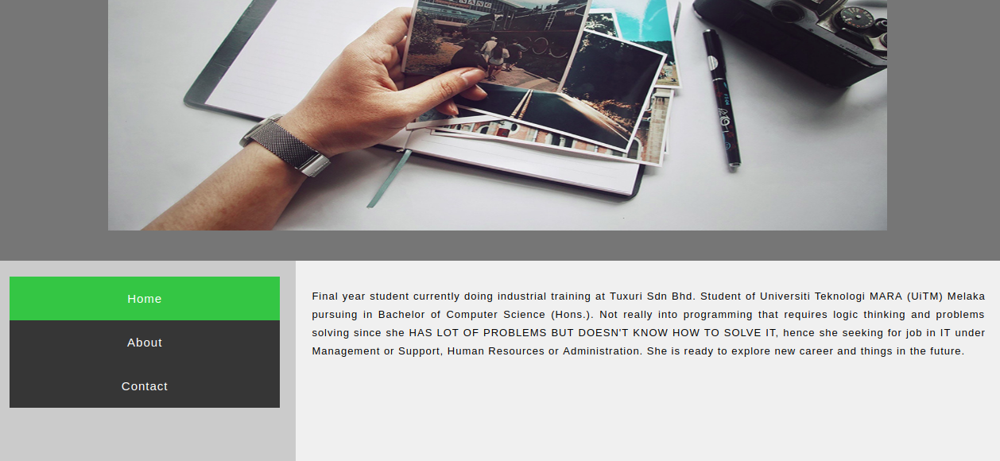

# **Internship Progress Report**

# Contents
  - [Read Me](#read-me)
  - [Tasks Performed](#task-performed)
  - [Notes](#notes)
  
# Read Me
- This is a progress report on what have been done during internship period.
- All codes were compiled and run using **Visual** Code studio.
- The operating system use is **Ubuntu** operating system.
  
# Tasks Performed

## **HTML, CSS and Javascript**

## **First tasks**

- First, is to learn HTML. HTML is Hypertext Markup Language that defines meaning and structure of web content. Example of HTML is as given below:

```<p>Hello, world!</p>```

- It consists opening and closing tag. Opening tag is ```<p>``` and closing tag is ```</p>```.

- First, is to create a portfolio page using HTML and CSS using [Bootstrap](https://getbootstrap.com/) Bootstrap is a framework for building responsive and mobile-first sites. Cascading Style Sheets (CSS) is how elements are displayed on the screens. Image shown below is a Home page of portfolio page using Materialize CSS, source: [Portfolio](https://www.youtube.com/watch?v=HcSLoR7oGHU)



- The header is an image style with CSS. Side of the portfolio page is navigation bar section with Home, About and Contact. On the right section is paragraph with ```<p>``` tag. The paragraph is syle with;

```article {
float: left;
font: Verdana;
text-align: justify;
letter-spacing: 1px;
line-height: 1.8;
font-size: 13px;
padding: 20px;
width: 70%;
background-color: #f1f1f1;
height: 300px;
}
```

- Image shown below is About page. About page is just the same with Home page. Header with an image style with CSS, left side is navigation bar and right side is content.


- Image shown below is Contact page. Contact page also is just the same with Home and About page. Header with an image style with CSS, left side is navigation bar that can go back to Home or About page if click on it. Contact page also have social media that will be directed to the page if click on it.


# **Second tasks**

- Next is to learn HTML, CSS and Javascript. Javascript is a computer programming language to create interactive effects with web browsers. Second is, create travel agency (source:) [Youtube](https://www.youtube.com/watch?v=MaP3vO-vEsg) by following tutorial on youtube.

- Top of the website is a fixed navigation bar with navigations links.